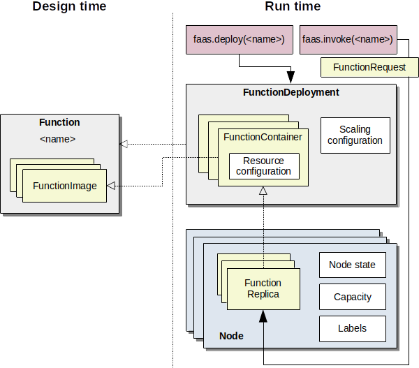
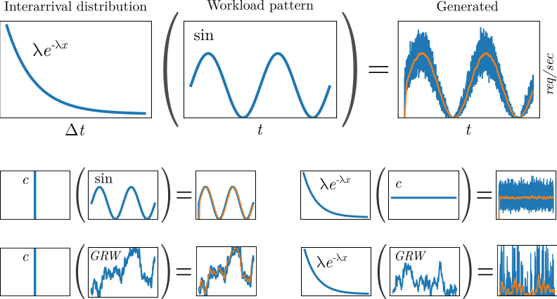

.. _concepts:

========
Concepts
========

Domain model
============

Our conceptual model of functions, deployments, and running replicas is shown in the following figure.

    Conceptual model of functions and their deployment.

Function
--------

A function is the highest level of abstraction and simply refers to some functionality that is identified by a *name* that can be invoked with a *FunctionRequest*.
For example, a function could be an object detector named "detect-objects", that takes as input an image, and returns the bounding boxes and labels of objects in the image.
A function is composed of several *FunctionImage* instances, one for each deployment platform.

FunctionImage
-------------

A FunctionImage is conceptually the code that implements a function on a specific deployment platform.
For example, our "detect-objects" function could have one version that makes use of the GPU, and one version that uses a TPU (an AI accelerator).

The reason for this additional abstraction has to do with the way container platforms like Docker deal with multiple computing architectures.
Docker images for different CPU architectures can be grouped via a `manifest to a multi-arch image <https://docs.docker.com/engine/reference/commandline/manifest/>`_, and a ``docker pull`` command will pull the correct image based on the node's architecture.
However, there is no way to include additional platform aspects such as GPUs or TPUs.
If two container images exist for the same function, one that uses the CPU and one that uses the GPU, it may be ambiguous at runtime which image to pull.
Instead, we want to allow the resource scheduler to affect the decision which image to deploy for a particular function.

.. TODO: document the other concepts

SimFunctionDeployment
------------------

A SimFunctionDeployment is an instance of a Function with a concrete resource allocation and scaling policy configuration.
A deployment consists of multiple FunctionContainer instances and said configurations.

FunctionContainer
-----------------

A FunctionContainer is the runtime configuration of a FunctionImage.
It has a specific resource configuration that declares how much resources are allocated on a node when a particular replica of this FunctionContainer is deployed.
In our running example, a GPU-based "object-detector" might require less CPU but more VRAM than the CPU-based FunctionImage.

SimFunctionReplica
---------------

A SimFunctionReplica is a concrete instantiation of a FunctionContainer.
It represents the actual running function (like a Docker container).

Node
----

A computer in the cluster that can host function replicas.
The NodeState is a generic container for data that is needed during simulation time,
for example to store the number of concurrent invocations to a particular replica to calculate performance degradation.

.. TODO: describe and link to performance degradation concepts

FaaS System
===========

The ``FaasSystem`` abstraction is the high-level interface a client can interact with.
Think of it like the main API gateway of OpenFaaS or the kube-apiserver of Kubernetes.

.. code-block:: python

    class FaasSystem(abc.ABC):

        def deploy(self, fn: SimFunctionDeployment): ...

        def invoke(self, request: FunctionRequest): ...

        def remove(self, fn: SimFunctionDeployment): ...

        def suspend(self, fn_name: str): ...

        def discover(self, fn_name: str) -> List[SimFunctionReplica]: ...

        def scale_down(self, fn_name: str, remove: int): ...

        def scale_up(self, fn_name: str, replicas: int): ...

        # additional lookup methods:
        def poll_available_replica(self, fn: str, interval=0.5): ...

        def get_replicas(self, fn_name: str, state=None) -> List[SimFunctionReplica]: ...

        def get_function_index(self) -> Dict[str, FunctionContainer]: ...

        def get_deployments(self) -> List[SimFunctionDeployment]:  ...

Conceptually the phases are:

* **deploy**: makes the function invokable and deploys the minimum number of ``SimFunctionReplica`` instances on the cluster. The number of minimum running instances is configured via ``SimScalingConfiguration``.

* **invoke**: the ``SimLoadBalancer`` selects a replica and simulates the function invocation by calling the ``invoke`` method of the associated ``FunctionSimulator``.
* **remove**: removes the function from the platform and shutsdown all running replias.

* **discover**: returns all running ``SimFunctionReplica`` instances that belong to the function.

* **scale_down**: removes the specified number of running ``SimFunctionReplica`` instances, with respect to the minimum requirement. The current implementation picks the most recent deployed replicas first.

* **scale_up**: deploys the specified number of ``SimFunctionReplica`` instances but has to respect the maximum number specified in the ``SimScalingConfiguration``.

* **suspend**: executes a teardown for all running replicas of a function. (used by ``faas_idler``).

* **poll_available_replica**: repeatedly waits and checks for running replicas of the function.

* **get_replicas**: gets all replicas in the specific state of a function. Returns all replicas in case of ``state == None``.

* **get_function_index**: returns all deployed ``FunctionContainers``.

* **get_deployments**: returns all deployed ``SimFunctionDeployment`` instances.

.. _Function Simulators:

Function simulators
===================

A FunctionSimulator encapsulates the simulation code for a function, and is one of the core abstractions of *faas-sim*.
*faas-sim* has several built-in function simulators that use traces from real functions and workloads as basis for the simulation.

The FunctionSimulator methods are invoked by the simulator to simulate the the different lifecycle phases of a function.

.. code-block:: python

    class FunctionSimulator(abc.ABC):

        def deploy(self, env: Environment, replica: SimFunctionReplica):
            yield env.timeout(0)

        def startup(self, env: Environment, replica: SimFunctionReplica):
            yield env.timeout(0)

        def setup(self, env: Environment, replica: SimFunctionReplica):
            yield env.timeout(0)

        def invoke(self, env: Environment, replica: SimFunctionReplica, request: FunctionRequest):
            yield env.timeout(0)

        def teardown(self, env: Environment, replica: SimFunctionReplica):
            yield env.timeout(0)

Conceptually the phases are:

* **deploy**:
  the SimFunctionReplica is being deployed on the node (e.g., pulling the container image using a ``docker pull`` command)
* **startup**:
  the replica is spinning up (e.g., starting the container with ``docker run``)
* **setup**:
  the runtime of the replica is starting up (e.g., if the function is a container with a python runtime then it may take a while to start the interpreter)
* **invoke**:
  the particular replica is being invoked by a FunctionRequest
* **teardown**:
  the replica is being destroyed (e.g., because it is being scaled down)

Each time the simulator creates a new function replica (because of deployment or scaling actions), the SimulatorFactory is called to create or return a FunctionSimulator for that replica.
The SimulatorFactory can be overwritten to return the same FunctionSimulator every time, create a new instance for each function replica, or any other behavior.

Get more details on function simulators in :ref:`Function Simulator Details` and our examples.

Simulation
==========

A simulation encapsulates the configuration and the runtime state of a simulation.
It requires two inputs: a topology and a benchmark.

Topology
--------

Wraps an `Ether <https://github.com/edgerun/ether>`_ topology and represents the cluster configuration and the network topology.

Benchmark
---------

A Benchmark encapsulates a particular simulation experiment.
It is invoked as a SimPy process that sets up the runtime system (e.g., creates container images, deploys functions) and creates workload by simulating function requests.
We provide several tools (like request generators) to create benchmarks.

It has two methods: ``setup`` and ``run``.
Once the simulation environment has been created, the ``setup`` method is called,
in which the system under test can be prepared (e.g., to populate a simulated container registry with images).
After that, the ``run`` method is invoked as the main SimPy process, and the simulation runs until the process terminates.

Request generators
==================

Composable functions for creating workload generators.
Usage example:

.. code-block:: python

    from requestgen import expovariate_arrival_profile, constant_rps_profile

    env = ...
    gen = expovariate_arrival_profile(constant_rps_profile(20))

    while True:
        ia = next(gen)
        yield env.timeout(ia)
        # send next request

The following figure shows several examples and the request patterns the produce:

    Composing inter-arrival distributions with workload patterns to generate workload.

The first row shows how to achieve a randomized sinusoidal request pattern.
For the interarrival distribution we use an exponential distribution.
The probability density function (PDF) of an exponential distribution is :math:`\lambda e^{-\lambda x}`, where :math:`\frac{1}{\lambda}` is the mean.
The workload pattern over follows a sine wave, and the value for :math:`\sin(t)` is used as :math:`\lambda` to scale the interarrival distribution.
At simulation time we therefore sample from the distribution :math:`\sin(t) e^{-\sin(t) x}` to receive the wait time until the next request.
The orange line shows a moving average of the requests per second, which should roughly match the workload pattern.
The second row shows how a constant interarrival distribution can be used to model exactly the workload pattern,
and how a constant workload profile can be used to model a static workload pattern with randomized interarrivals.
The last row shows Gaussian random walks (GRW), where each value represents a random sample from a Normal distribution, that is then used as value for :math:`\mu` in the next random sample.
The request profile can be parameterized with a :math:`\sigma` value that affects the fluctuation over time.

.. hint::

    You can find code examples to generate patterns in our Jupyter Notebook (``workload_patterns.ipynb``) and a
    simulation example under ``examples/request_gen``.

