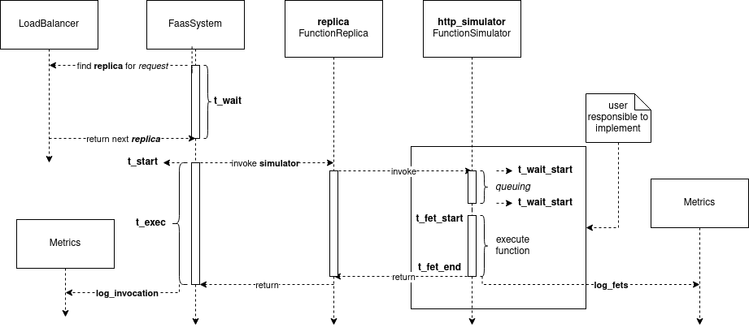

.. _Function Simulator Details:

====================
Function Simulators
====================

This section is dedicated to showcase a selection of pre-defined function simulators and gives details on how to implement one yourself.

.. attention::

    Make sure you've familiarized yourself with :ref:`Resources` and :ref:`Function Simulators`.

As our work is heavily influenced by the design and architecture of `OpenFaaS`_, we provide two implementations of `FunctionSimulator` that model the behavior of *forking* and *HTTP* modes (see `Watchdog modes`_).

The implementations are located in ``sim/faas/watchdogs.py`` and can be imported with:

.. code-block:: python

    from sim.faas import ForkingWatchdog, HTTPWatchdog

The abstract class that represents the general Watchdog concept looks like this:

.. code-block:: python

    class Watchdog(FunctionSimulator):

    def claim_resources(self, env: Environment, replica: SimFunctionReplica, request: FunctionRequest): ...

    def release_resources(self, env: Environment, replica: SimFunctionReplica, request: FunctionRequest): ...

    def execute(self, env: Environment, replica: SimFunctionReplica, request: FunctionRequest): ...

The ``HTTPWatchdog`` uses a queuing mechanism to simulate works and claims resources after the request received a token (i.e., a worker is available).
The ``ForkingWatchdog`` claims and executes each request immediately without further delay.

.. attention::

    When using the ``ForkingWatchdog`` make sure that you limit manually the requests due to RAM usage for each fork.

The following figure shows the log events that happen during the execution with the ``HTTPWatchdog`` and also depicts the interaction between different system components.

.. _OpenFaaS: https://docs.openfaas.com/
.. _Watchdog modes: https://github.com/openfaas/of-watchdog#modes

